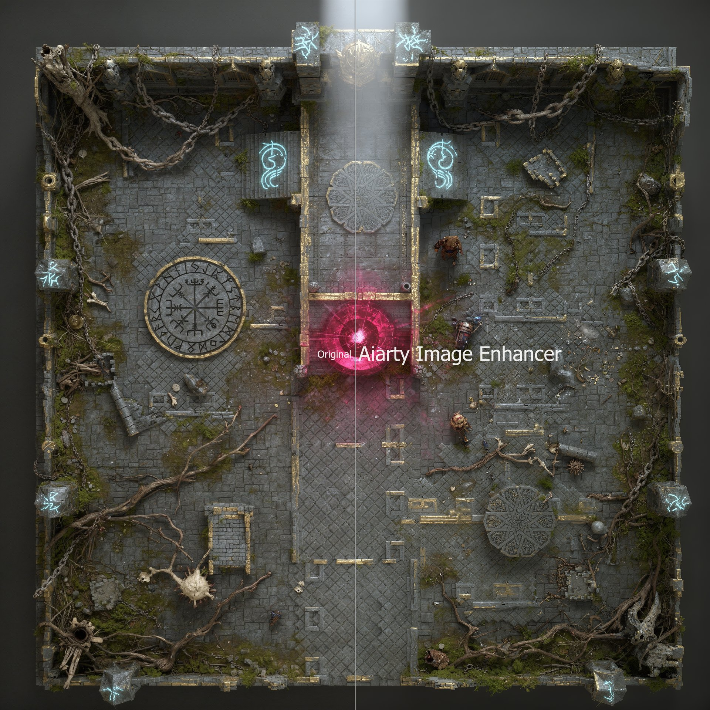
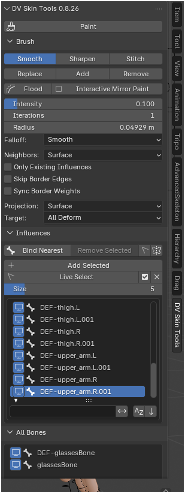
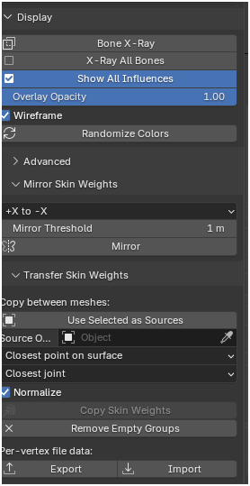

  

<h1 align="center">DV Skin Tools</h1>

  <strong>Maya-style multi-influence skinning for Blender weight paint.</strong> 
  Smooth every bone at once. Bind, mirror, copy, and visualize weights the way character TDs expect.

  
  
  
  

  <a href="#install">Install</a> ·
  <a href="#features">Features</a> ·
  <a href="#brush">Brush</a> ·
  <a href="#shortcuts">Shortcuts</a> ·
  <a href="#author">Author</a>

---

## Tutorials:
https://www.youtube.com/playlist?list=PLUrd_Y4UuCw0

## Why DV Skin Tools

Blender’s default Blur brush edits **one vertex group**. Production skinning does not work that way.

DV Skin Tools paints **all deform influences together**, then re-normalizes — the same mental model as Maya’s Paint Skin Weights tool. Smooth keeps neighboring weights proportional, so joints deform cleanly and textures stretch less.

<table>
  <tr>
    <td width="50%" valign="top">
      
      
Brush, influences, and All Bones

    </td>
    <td width="50%" valign="top">
      
      
Display, mirror, and weight transfer

    </td>
  </tr>
</table>

---

## Features

| | |
| --- | --- |
| **Multi-influence Smooth** | Laplacian smooth across every bone at once. Nearby vertices keep relative weight transitions (Maya-style), not a per-vert percentage that tears the gradient. |
| **Sharpen / Stitch** | Push definition back, or blend open-seam borders toward their partners. |
| **Replace / Add / Remove** | Paint the active bone. Intensity is the target, the add amount, or the subtract amount. |
| **Bind Nearest** | Hard-assign each vertex to the closest deform bone (head–tail segment). Optional vertex mask. |
| **Interactive Mirror Paint** | Paint one side; the other side gets the mirrored vertex and the mirrored bone. |
| **Copy Skin Weights** | Maya-style transfer between meshes: closest point or nearest vertex, joint matching by proximity or name. |
| **Show All Influences** | Rainbow overlay of every bone, driven by the real weights — not a single-group heatmap. |
| **Weight undo** | Ctrl+Z / Ctrl+Shift+Z for strokes, floods, and binds. Overlay colors follow the restored weights. |

---
## Full List of features
**Brush**
- Modes: Smooth, Sharpen, Stitch, Replace, Add, Remove (each remembers its own Intensity)
- Maya-style relative Smooth (neighbors stay proportional)
- Flood (mesh or paint mask)
- Interactive Mirror Paint (mirrored vert + mirrored bone)
- Intensity, Iterations, Radius (auto-sized to the mesh)
- Falloff: Smooth / Linear / Sphere / Constant
- Neighbors: Surface or Volume (+ Volume Radius)
- Only Existing Influences
- Skip Border Edges, Sync Border Weights, Stitch Threshold
- Projection: Surface or Screen
- Target: All Deform or Selected Bones
- Front Faces Only, Airbrush, tablet pressure, stamp Spacing
- Max Influences cap, Prune tiny weights
- Locked vertex groups always preserved
- Ctrl while painting flips Smooth ↔ Sharpen
- Hold Shift = temporary brush; F / Shift+F / [ ] resize; Esc/RMB exit
- Auto geometry refresh when the posed mesh moves

**Influences**
- Bind Nearest (optional Selected-only + Mirror)
- Remove Selected (strip weights, no redistribute)
- Add Selected (creates groups; adds Armature modifier if missing)
- Live Select; hold S add / hold D subtract; invert / deselect all
- Searchable influence list (filter, sort, lock icons, list height)
- All Bones: every deform bone in the scene, searchable

**Mirror / transfer**
- Mirror Skin Weights: +X→−X, −X→+X, or Heavier Side
- Mirror Threshold, custom Mirror Pattern (R-arm, Arm_R, etc.)
- Copy Skin Weights: one source or all other selected meshes
- Surface: closest point or nearest vertex
- Influence match: closest joint, name, or one-to-one
- Normalize on/off; Remove Empty Groups
- Export / Import per-vertex JSON (+ Maya script)

**Display**
- Show All Influences (Maya rainbow overlay)
- Overlay Opacity, Wireframe overlay, Randomize Colors
- Bone X-Ray, X-Ray All Bones (even hidden collections)
- Overlay follows undo; Object Mode restores the mesh

**Undo / workflow**
- Weight undo/redo (Ctrl+Z / Ctrl+Shift+Z) for strokes, flood, bind
- Enter Weight Paint from the panel
- Assign shortcuts on toggles (X-Mirror, X-Ray, Show All)

## Install

**Blender 4.2+** (including Blender 5)

1. [Download the latest `dv_skin_tool-*.zip`](https://github.com/davoodtaba-glitch/dv-skin-tools/releases) — or zip this repository (source files only).
2. **Edit → Preferences → Get Extensions** (or **Add-ons**) → **Install from Disk**.
3. Choose the zip and enable **DV Skin Tools**.
4. In the 3D Viewport, open the **N** panel → **DV Skin Tools**.

If an older *Skin Tools* or *DV Skin Tools* add-on is installed, remove it first.

---

## Brush

Weight Paint mode → **Paint** to start a session. The sidebar stays live.

| Mode | What it does |
| --- | --- |
| **Smooth** | Average all influences with neighbors. Close vertices move together. |
| **Sharpen** | Push weights away from the neighbor average. |
| **Stitch** | Blend border vertices toward their partner across a seam gap. |
| **Replace** | Set the active bone to Intensity. |
| **Add** | Add Intensity to the active bone. |
| **Remove** | Subtract Intensity from the active bone. |

**Flood** applies the current mode to the whole mesh, or only the paint mask.

Leave **Only Existing Influences** off to blend between bones. Turn it on to keep each vertex on the influences it already has.

---

## Shortcuts

| Input | Action |
| --- | --- |
| **LMB** | Paint |
| **F** | Resize radius (drag, LMB confirm, RMB/Esc cancel) |
| **Shift+F** | Intensity |
| **Hold Shift** | Temporary DV Skin brush (release to restore the previous tool) |
| **Hold S** | Pick influence (always add) |
| **Hold D** | Live Select subtract |
| **Ctrl+Z** / **Ctrl+Shift+Z** | Undo / redo last DV Skin edit |
| **Esc / RMB** | Exit the brush and restore Blender’s default tool |
| **Mouse wheel** | Viewport zoom (not brush size) |
| **[ ]** | Shrink / grow radius |

---

## Bind, mirror, copy

**Bind Nearest** — selected pose bones, or all deform bones if none are selected. Selected vertices (or the paint mask) if you have a mask; otherwise the whole mesh.

**Mirror** — copies weights across local X and flips `.L` / `.R` names. Works on a posed armature.

**Copy Skin Weights** — source mesh(es) → active mesh. Missing vertex groups are created. Locked groups and the vertex mask are respected.

---

## Display

**Show All Influences** colors every bone at once. Use **Bone X-Ray** so bones read through the overlay. Object Mode turns the overlay off so the mesh is never left hidden.

**Randomize Colors** re-rolls the palette only — weights stay untouched.

---

## Maya companion

`maya/dv_skin_weights_io.py` reads and writes the same per-vertex JSON as Blender **Export / Import**, so weights can move between Maya and Blender without resampling the surface.

---

## Author

**Davood Taba**  
[davoodice@gmail.com](mailto:davoodice@gmail.com)

GPL-3.0-or-later. Contributions and issue reports are welcome.
