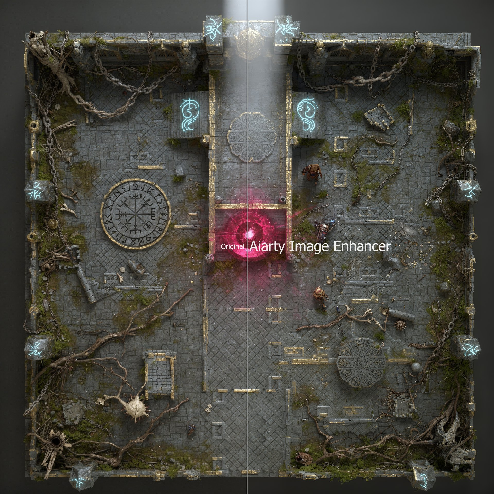

  

<h1 align="center">DV Skin Tools</h1>

  <strong>Maya-style multi-influence skinning for Blender weight paint.</strong> 
  Smooth every bone at once. Bind, mirror, copy, and visualize weights the way character TDs expect.

  
  

---

## Install

**Blender 4.2+** (including Blender 5)

1. Download [`dv_skin_tool-0.8.30-protected.zip`](https://github.com/davoodtaba-glitch/dv-skin-tools/releases/latest) from Releases, or the zip in this repository.
2. In Blender: **Edit → Preferences → Get Extensions** (or **Add-ons**) → **Install from Disk**.
3. Choose the zip and enable **DV Skin Tools**.
4. In the 3D Viewport, open the **N** panel → **DV Skin Tools**.

If an older *Skin Tools* or *DV Skin Tools* add-on is installed, remove it first, then restart Blender before installing.

[User Guide (PDF)](DV_Skin_Tools_User_Guide.pdf)

---

## Brush

Weight Paint mode → **Paint** to start a session. The sidebar stays live.

| Mode | What it does |
| --- | --- |
| **Smooth** | Average all influences with neighbors. Close vertices move together. |
| **Sharpen** | Push weights away from the neighbor average. |
| **Stitch** | Blend border vertices toward their partner across a seam gap. |
| **Replace** | Set the active bone to Intensity. |
| **Add** | Add Intensity to the active bone. |
| **Remove** | Subtract Intensity from the active bone. |

**Flood** applies the current mode to the whole mesh, or only the paint mask.

**Ignore Gap** (Replace, Add, Remove, Sharpen): when off, only vertices connected to the hit surface are painted, so a brush over a waist gap does not stamp a disconnected shell. Smooth and Stitch never use this filter.

---

## Author

Davood Taba — [davoodice@gmail.com](mailto:davoodice@gmail.com)
